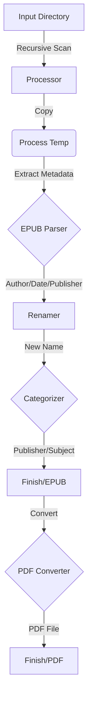

# Architecture Overview

**Last Updated:** 2026-02-12
**Entry Point:** `main.py` -> `src/core/processor.py`

## Directory Structure

```
Everything Claude Code/
├── input/                  # Source directory for raw files (recursive scan)
├── process/                # Temporary working directory
├── finish/                 # Final output directory
│   ├── epub/               # Categorized EPUB files
│   └── pdf/                # Converted PDF files
├── src/
│   ├── core/               # Main application logic
│   ├── services/           # Specific business logic modules
│   └── utils/              # Generic helper functions
├── main.py                 # Application entry point
├── run_auto.bat            # Windows automated execution script
└── requirements.txt        # Python dependencies
```

## Core Components

### 1. Processor (`src/core/processor.py`)
The orchestrator of the entire workflow. It handles:
- File discovery (recursive `rglob`)
- Progress reporting (`tqdm`)
- Workflow steps coordination:
  1.  Copy to process
  2.   Clean filename
  3.  Fetch Metadata (EPUB -> Web Fallback)
  4.  Categorize & Move (Publisher -> Keyword Fallback)
  5.  Convert to PDF
  6.  Summary Report

### 2. Services (`src/services/`)
Specialized modules for distinct tasks.
See [Services Codemap](services.md) for detailed API documentation.

### 3. Utilities (`src/utils/`)
- `file_ops.py`: Low-level file operations (copy, move, rename) with error handling.

## Data Flow


